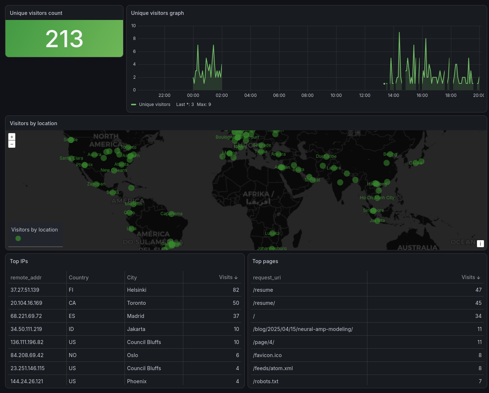

# Leshnik



`leshnik` tails nginx access logs and pushes them to Grafana Loki.

It uses `inotify`, expands files from glob patterns, accepts nginx `combined`
logs and newline-delimited JSON logs, and handles common log rotation patterns.
The tailer watches both parent directories and each matched file: directories
for rotation/new-file discovery, files for appended log lines.

## Build

```sh
cargo build --release
```

## Grafana Dashboard

An importable Grafana dashboard is available at
[dashboards/leshnik-nginx-web-analytics.json](dashboards/leshnik-nginx-web-analytics.json).
It uses Grafana's built-in Geomap panel and has only two dashboard variables:
`server` and `filename`. Select `server = nginx` and then the log file you want,
for example `/var/log/nginx/meka.rs.log`.

## Configuration

Create a TOML file. See [config.example.toml](config.example.toml) for a full
example.

```toml
[geoip]
database = "/path/to/GeoLite2-City.mmdb"

[loki]
url = "http://localhost:3100/loki/api/v1/push"
tenant_id = ""
batch_size = 100
batch_timeout_ms = 1000
timeout_secs = 10

[loki.labels]
job = "nginx"
host = "example-host"

[[watch]]
glob = "/var/log/nginx/*.log"
ignore = [
  "/var/log/nginx/error.log",
  "/var/log/nginx/*.old.log",
]
ignore_ips = [
  "127.0.0.1",
  "192.168.111.0/24",
  "192.168.111.10-192.168.111.20",
  "2001:db8::/32",
  "2001:db8:abcd::10-2001:db8:abcd::20",
  "2001:db8:ffff::",
]
ignore_paths = [
  "/stub_status",
  "/healthz",
  "/api/*",
  "/robots.txt",
  "/sitemap.xml",
  "/assets/*",
  "*.css",
  "*.js",
  "*.jpg",
  "*.png",
  "*.gif",
  "*.woff2",
  "*.pdf",
]
ignore_status = [
  301,
  302,
]
format = "combined"
from_beginning = false

[watch.labels]
source = "nginx-access"

[[watch]]
glob = "/var/log/nginx/*.json.log"
format = "json"
from_beginning = false

[watch.labels]
source = "nginx-json-access"
```

`ignore` is optional. It is an array of glob patterns checked against matched
paths before a file watch is installed.

`ignore_ips` is optional. It filters parsed client addresses before sending to
Loki. Entries can be exact IPv4/IPv6 addresses, IPv4/IPv6 CIDR blocks,
IPv4/IPv6 ranges written as `start-end`, or IPv6 prefixes ending in `::`.

`ignore_paths` is optional. It is an array of glob patterns matched against the
URL path before sending to Loki. Query strings are ignored for matching, so
`/search?q=test` is matched as `/search`.

`ignore_status` is optional. It filters parsed HTTP status codes before sending
to Loki. For example, `301` and `302` redirects can be skipped so a redirect and
its destination are not both counted as page hits.

`[geoip]` is optional. Configure it with a MaxMind GeoLite2 City database.
`leshnik` enriches JSON output with country fields plus `geoip_city_name`,
`geoip_latitude`, and `geoip_longitude`. The included Grafana Geomap panel uses
latitude/longitude coordinates.

Run it with:

```sh
leshnik --config config.toml --log-level info
```

Valid log levels are `error`, `warning`, `info`, and `debug`.

## Log Formats

`format = "combined"` expects the standard nginx combined access log shape:

```nginx
log_format combined '$remote_addr - $remote_user [$time_local] '
                    '"$request" $status $body_bytes_sent '
                    '"$http_referer" "$http_user_agent"';
```

The timestamp in `$time_local` is used as the Loki timestamp.
Combined log lines are sent to Loki as JSON, with the original raw line kept in
the `message` field. The JSON includes aliases used by common nginx Loki
dashboards, including `request_uri`, `http_referer`, `http_user_agent`,
`request_method`, `server_protocol`, `request_time`, `geoip_country_code`,
`geoip_country_iso3`, `geoip_city_name`, `geoip_latitude`, and
`geoip_longitude`.
This makes fields available to LogQL with `| json`, for example:

```logql
sum by (status) (count_over_time({source="nginx-access"} | json [5m]))
```

`format = "json"` expects one JSON object per line. If a string field named
`time`, `time_local`, `timestamp`, or `@timestamp` exists, it is used as the
Loki timestamp. RFC3339 values and nginx `$time_local` values are supported. If
no timestamp field exists, the current time is used.

Every watched file also gets a `filename` Loki label containing the full log
path.

Dashboard 13865 expects the `filename` dashboard variable to match the exact log
path, for example `/var/log/nginx/sys.it.com.log`. Its default host variable may
reference `/var/log/nginx/json_access.log`, so edit that variable if your log
path is different.

## Rotation Behavior

The program watches parent directories and matched log files. When nginx
rotates logs by renaming `access.log` and creating a new `access.log`, the
directory event causes a glob rescan and the file watch is moved to the new
inode. Before switching to the new inode, the tailer drains the old open file
descriptor so lines written right before nginx reopens the log are still sent.

It also detects copy-truncate rotation by noticing when the current file becomes
shorter than the last read offset, then starts reading from the beginning of the
truncated file.

For normal service usage, prefer `from_beginning = false` so a restart starts at
EOF and does not resend existing logs.

## Why that name

In Slavic mithology, Leshy is closest to Loki in Norse mithology, but as I am Serb
I am using Serbian name: Leshnik. To be precise, in Serbian it is Lešnik, but it is
really hard to handle UTF-8 in program names, so I simplified it. Leshnik is protector
of woods and animals, but it also means "heazelnut".
